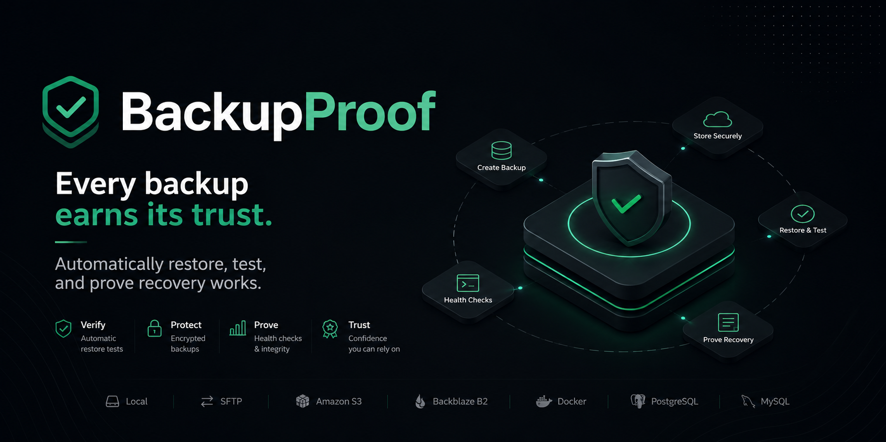

# BackupProof



> **Every backup earns its trust.**

**BackupProof** is an open-source, self-hosted backup verification platform that automatically restores, tests, and proves recovery works.

Most backup solutions only tell you a backup completed successfully. BackupProof goes one step further by continuously verifying that your backups can actually be restored when disaster strikes.

## Why BackupProof?

A successful backup does not guarantee a successful recovery.

Corrupted archives, missing files, broken databases, invalid credentials, and infrastructure changes can make backups useless when they are needed most.

BackupProof eliminates uncertainty by automatically:

* Creating encrypted backups
* Restoring backups into a verification environment
* Running recovery tests
* Validating checksums and integrity
* Generating restore proof reports
* Tracking recovery confidence over time

**Don't trust backups. Prove them.**

---

## Features

### Backup Verification

* Automatic restore testing
* Recovery proof reports
* Health checks after restore
* SHA-256 integrity verification
* Confidence score for every protected application

### Built-in Backup Engine

No external binaries required.

* Incremental backups
* Chunk-based storage
* AES-256-GCM encryption
* Deduplication through manifest tracking
* Repository integrity verification

### Storage Backends

* Local filesystem
* SFTP
* Amazon S3
* Backblaze B2

### Infrastructure Awareness

Automatic discovery of:

* Docker containers
* Docker Compose projects
* PostgreSQL databases
* MySQL / MariaDB databases
* Common application data directories

### Recovery Workflows

* One-click restore testing
* Disaster recovery reports
* Recovery history tracking
* Restore verification badges

### Operations

* Scheduler
* Alerts & notifications
* Audit logs
* Role-based access control
* Multi-destination backups

---

## How It Works

```text
Protect Data
     ↓
Create Backup
     ↓
Store Securely
     ↓
Automatic Restore Test
     ↓
Health Checks
     ↓
Integrity Verification
     ↓
Restore Proof Report
     ↓
Confidence Score
```

---

## Quick Start

### Docker (recommended)

The fastest way to run BackupProof in production is with Docker Compose. The container listens on port **8787** and mounts the host filesystem read-only at `/host` so you can back up paths like `/host/var/www`.

```bash
git clone https://github.com/chmuzamil/backupproof.git
cd backupproof
```

Edit `docker-compose.yml` and set a strong **`FRD_ENCRYPTION_KEY`** (at least 32 characters). This key encrypts stored credentials and must stay the same across restarts.

```bash
docker compose up -d --build
```

Open:

```text
http://localhost:8787
```

**Useful commands:**

```bash
docker compose logs -f          # follow logs
docker compose pull && docker compose up -d --build   # update
docker compose down             # stop
```

**Volumes**

| Mount | Purpose |
| ----- | ------- |
| `frd-data` → `/data` | BackupProof state, vault metadata, job history |
| `/` → `/host:ro` | Read-only access to host files for backup and discovery |

When protecting data on the host machine, prefix paths with `/host` (for example `/host/var/www` or `/host/home/user/photos`).

**Environment variables**

| Variable | Default | Description |
| -------- | ------- | ----------- |
| `FRD_DATA_DIR` | `/data` | Persistent data directory inside the container |
| `FRD_ENCRYPTION_KEY` | *(required)* | Secret used to encrypt stored credentials |
| `FRD_MAX_CONCURRENT_JOBS` | `3` | Maximum parallel backup/restore jobs |
| `PORT` | `8787` | HTTP port (also set in `ports` mapping) |

Optional: mount the Docker socket if you want container discovery from inside BackupProof:

```yaml
volumes:
  - /var/run/docker.sock:/var/run/docker.sock:ro
```

### Development

```bash
npm install
npm run dev
```

Open:

```text
http://localhost:5173
```

### Production (without Docker)

```bash
npm install
npm run build
npm start
```

Open:

```text
http://localhost:8787
```

Set `FRD_DATA_DIR` and `FRD_ENCRYPTION_KEY` in the environment for persistent, encrypted storage.

---

## Protect Data

BackupProof uses a simple guided workflow.

### Step 1 — Select Data

Protect:

* Files and folders
* Docker Compose applications
* PostgreSQL databases
* MySQL / MariaDB databases

Choose:

* Scan this machine
* Enter paths manually

### Step 2 — Choose Storage

Available destinations:

* Local storage
* SFTP
* S3
* Backblaze B2

### Step 3 — Define Restore Proof

Verify backups by:

* Checking file existence
* Verifying checksums
* Testing HTTP endpoints
* Running custom health checks

### Step 4 — Enable Protection

BackupProof begins:

* Backing up
* Restoring
* Testing
* Verifying

Automatically.

---

## Built-in Backup Engine

BackupProof ships with its own backup engine.

| Capability           | Support       |
| -------------------- | ------------- |
| Incremental backups  | ✅             |
| Encryption           | ✅ AES-256-GCM |
| Deduplication        | ✅             |
| Restore verification | ✅             |
| Integrity checks     | ✅             |
| Local storage        | ✅             |
| SFTP                 | ✅             |
| S3                   | ✅             |
| B2                   | ✅             |

No Restic, Kopia, or external tools required.

---

## Optional External Engines

BackupProof can also integrate with:

* Restic
* Kopia

When installed, repositories can be imported and managed through the BackupProof dashboard.

---

## CLI

```bash
npm run cli -- status

npm run cli -- backup run <appId>

npm run cli -- proof run <appId>

npm run cli -- restore <appId> --snapshot <id>
```

---

## Example Use Cases

### Homelab

Verify that Docker applications can actually be restored after hardware failure.

### SaaS Applications

Automatically test PostgreSQL restores and application health checks.

### Small Business

Protect critical files and continuously verify recovery readiness.

### Managed Service Providers

Monitor backup confidence across multiple customer environments.

---

## Architecture

```text
React Dashboard
        │
        ▼
BackupProof Orchestrator
        │
        ▼
Backup Engine
(FRD / Restic / Kopia)
        │
        ▼
Storage Providers
(Local / SFTP / S3 / B2)
```

---

## Roadmap

### v1

* Backup verification
* Restore proof reports
* Confidence scoring
* Docker support
* PostgreSQL support
* MySQL support

### v2

* Agent-based backups
* Kubernetes support
* Immutable storage
* Recovery simulations
* Advanced compliance reporting

### v3

* Multi-node deployments
* Enterprise SSO
* Team collaboration
* Recovery analytics

---

## Security

* AES-256-GCM encryption
* Repository passphrases
* Integrity verification
* Audit logs
* RBAC support

---

## Contributing

See [CONTRIBUTING.md](CONTRIBUTING.md) for setup, guidelines, and pull request expectations.

Bug reports, feature ideas, and pull requests are welcome on [GitHub Issues](https://github.com/chmuzamil/backupproof/issues).

---

## License

This project is licensed under the [MIT License](LICENSE).

Copyright (c) 2026 [chmuzamil](https://github.com/chmuzamil)
